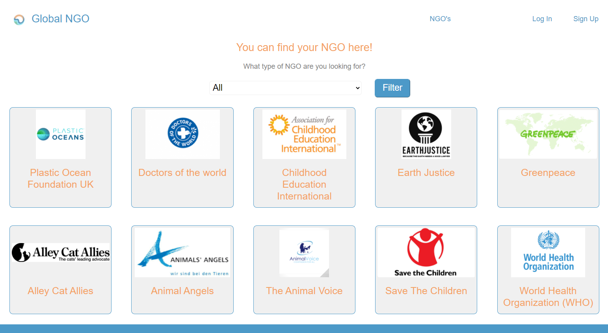

# GlobalNGO

## Description

This app is a platform for unifying worldwide NGOs and help them to make their work more visible. Each NGO has different aims and different action points, so here they have the space to show their work and the objectives of their fights.

In this app you'll find all the organizations that people posted and are going to be able to filter them according to the their main aim. For posting a new NGO the user will have to log in, after that their will be able to managed the post from their profile page.

## MVP

If you don't have an account:
- You can see the list of NGOs and filter them.
- You can also see the detailed page of each NGO.

If you have an account:
- The user has the possibility to sign-up, log-in and log-out.
- The user can edit their profile information or delete their account.
- The user can create, edit or delete as many NGO as they want.

## Website

SEE THE APP:

https://globalngo.herokuapp.com/

## Built with

- NodeJs
- CSS3
- MongoDB
- HandlebarsJs
- ExpressJs